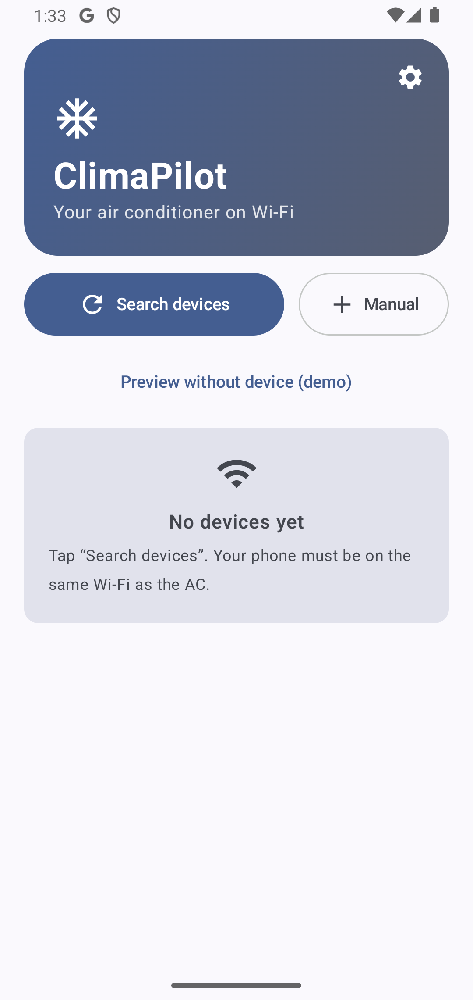

# ClimaPilot

**Control your Midea air conditioner locally over Wi-Fi — no cloud account required.**
**Steuere deine Midea-Klimaanlage lokal im WLAN — ganz ohne Cloud-Konto.**

  
  &nbsp;&nbsp;
  

🇬🇧 [English](#english) · 🇩🇪 [Deutsch](#deutsch)

---

## English

ClimaPilot is a small, ad-free Android app that talks **directly to your Midea air conditioner on the local network**. Your phone and the AC only need to be on the same Wi-Fi — nothing is sent through a manufacturer cloud.

### Features
- 🔌 **Local control** over Wi-Fi (LAN protocol, V3 devices)
- 🌡️ Power, mode (auto / cool / dry / heat / fan), target temperature
- 💨 Fan speed presets + fine slider, swing, eco mode, beep
- 📊 Live status: indoor / outdoor temperature, power draw, total consumption, error code
- ⚡ Quick scenes & sleep timer
- 🧊 Compressor throttle (where supported)
- 👀 Demo mode — explore the UI without a device

### Install
1. Download the latest `climapilot-0.1.apk` from the [**Releases**](https://github.com/pit711/climapilot/releases) page.
2. On your phone, allow installing from unknown sources when prompted.
3. Open the app, tap **Search devices** (phone must be on the same Wi-Fi as the AC), and connect.

If automatic discovery fails, you can add a device by hand via **Manual** (IP, port, device ID).

### Support development
ClimaPilot is free and ad-free. If it saves you a trip to the remote, a small tip keeps it going:
- ☕ **Ko-fi:** https://ko-fi.com/711it
- 💸 **PayPal:** https://paypal.me/711IT

### Credits
Huge thanks to **[@mill1000](https://github.com/mill1000)** and the **[midea-msmart](https://github.com/mill1000/midea-msmart)** project. ClimaPilot's entire local Midea protocol — LAN handshake, encryption, command framing and the NetHome Plus cloud token exchange — is a Kotlin port of their excellent, meticulously reverse-engineered work. Without it, this app simply wouldn't exist. ❤️

### Disclaimer
ClimaPilot is an independent project and is **not affiliated with, endorsed by, or supported by Midea**. It controls compatible air conditioners over your local Wi-Fi. Make sure your unit is correctly installed and safe to operate before sending commands. Use at your own risk; the authors accept no liability for any damage or loss. Measured values such as power draw come from the device and may be inaccurate.

---

## Deutsch

ClimaPilot ist eine kleine, werbefreie Android-App, die **direkt mit deiner Midea-Klimaanlage im lokalen Netzwerk** spricht. Handy und Klima müssen nur im selben WLAN sein — es läuft nichts über eine Hersteller-Cloud.

### Funktionen
- 🔌 **Lokale Steuerung** über WLAN (LAN-Protokoll, V3-Geräte)
- 🌡️ Ein/Aus, Modus (Auto / Kühlen / Trocknen / Heizen / Lüften), Zieltemperatur
- 💨 Lüfter-Presets + Feinregler, Swing, Eco-Modus, Signalton
- 📊 Live-Status: Innen-/Außentemperatur, Leistung, Gesamtverbrauch, Fehlercode
- ⚡ Schnell-Szenen & Sleep-Timer
- 🧊 Kompressor-Drossel (wo unterstützt)
- 👀 Demo-Modus — UI ohne Gerät ausprobieren

### Installation
1. Lade die aktuelle `climapilot-0.1.apk` von der [**Releases**](https://github.com/pit711/climapilot/releases)-Seite.
2. Erlaube auf dem Handy bei der Nachfrage die Installation aus unbekannten Quellen.
3. Öffne die App, tippe auf **Geräte suchen** (Handy im selben WLAN wie die Klima) und verbinde dich.

Falls die automatische Suche scheitert, kannst du ein Gerät per **Manuell** von Hand hinzufügen (IP, Port, Geräte-ID).

### Entwicklung unterstützen
ClimaPilot ist kostenlos und werbefrei. Wenn es dir den Weg zur Fernbedienung erspart, hält ein kleines Trinkgeld es am Leben:
- ☕ **Ko-fi:** https://ko-fi.com/711it
- 💸 **PayPal:** https://paypal.me/711IT

### Danksagung
Riesigen Dank an **[@mill1000](https://github.com/mill1000)** und das Projekt **[midea-msmart](https://github.com/mill1000/midea-msmart)**. Das komplette lokale Midea-Protokoll von ClimaPilot — LAN-Handshake, Verschlüsselung, Befehls-Framing und der NetHome-Plus-Cloud-Token-Austausch — ist eine Kotlin-Portierung ihrer hervorragenden, akribisch reverse-engineerten Arbeit. Ohne sie würde es diese App nicht geben. ❤️

### Haftungsausschluss
ClimaPilot ist ein unabhängiges Projekt und steht **in keiner Verbindung zu Midea, wird von Midea weder unterstützt noch freigegeben**. Die App steuert kompatible Klimaanlagen über dein lokales WLAN. Stelle sicher, dass dein Gerät korrekt installiert und betriebssicher ist, bevor du Befehle sendest. Die Nutzung erfolgt auf eigene Gefahr; die Autoren übernehmen keine Haftung für Schäden oder Verluste. Messwerte wie die Leistung stammen vom Gerät und können ungenau sein.
