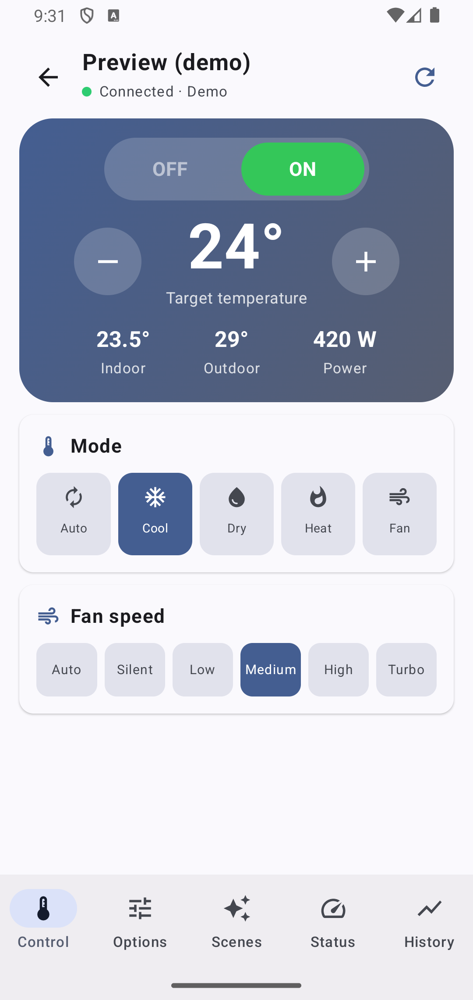
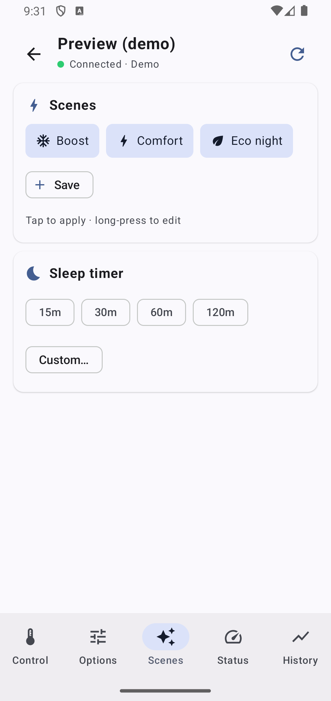
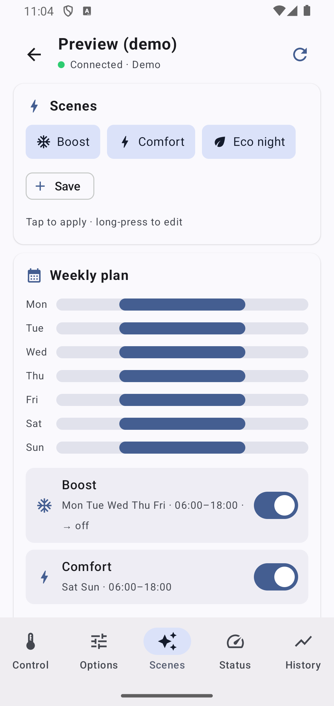
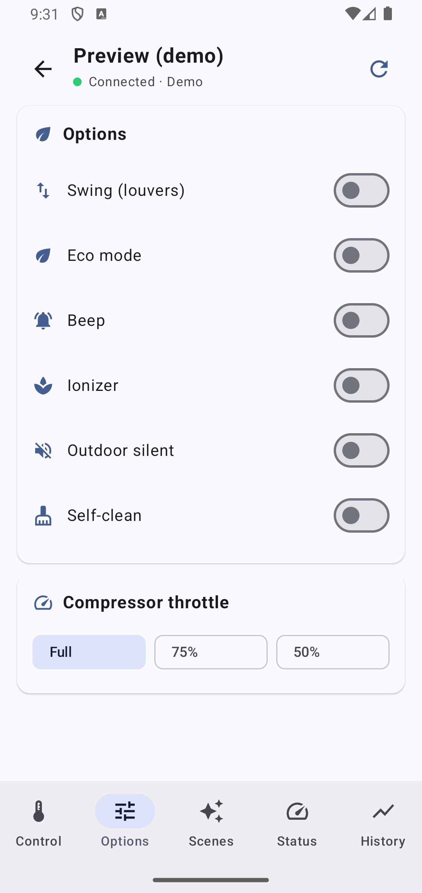
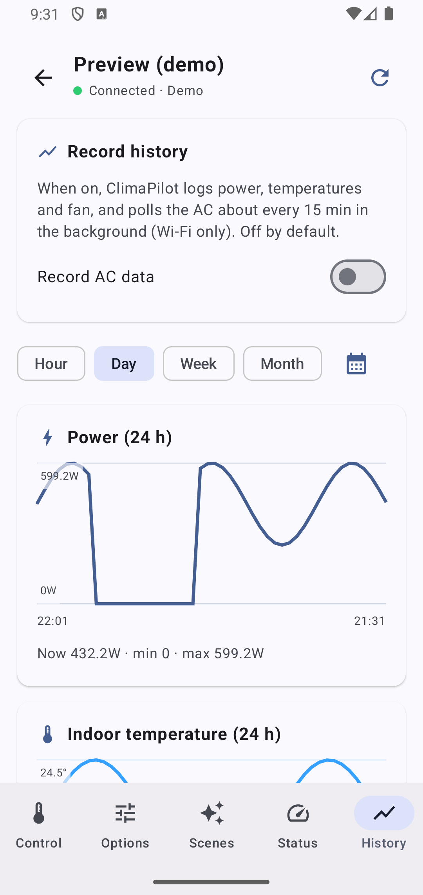

# ClimaPilot

**Control your Midea air conditioner locally over Wi-Fi — no cloud account required.**
**Steuere deine Midea-Klimaanlage lokal im WLAN — ganz ohne Cloud-Konto.**

  
  &nbsp;
  
  &nbsp;
  
  &nbsp;
  
  &nbsp;
  

🇬🇧 [English](#english) · 🇩🇪 [Deutsch](#deutsch)

---

## English

ClimaPilot is a small, ad-free Android app that talks **directly to your Midea air conditioner on the local network**. Your phone and the AC only need to be on the same Wi-Fi — nothing is sent through a manufacturer cloud.

### Features
- 🔌 **Local control** over Wi-Fi (LAN protocol, V3 devices)
- 📴 **Works offline after the first connect** — a one-time token is fetched once (no account); afterwards no internet is needed
- 🌡️ Power, mode (auto / cool / dry / heat / fan), target temperature (°C/°F)
- 💨 Fan speed presets + fine slider, swing, eco mode, beep
- 🌬️ Device-specific modes where supported: ionizer, outdoor-silent, self-clean
- 📊 Live status: indoor / outdoor temperature, power draw, consumption, **estimated cost** (price per kWh)
- ⚡ Quick scenes with a full editor & **daily schedule**
- 📅 **Weekly day-planner** — assign scenes to recurring weekday + time windows (e.g. *max cooling on Mondays, 6–18*) on a visual week calendar; each window applies its scene at the start and can switch the AC off at the end. Runs in the background even while the phone is idle on Wi-Fi.
- 🧊 Compressor throttle (where supported) · reliable sleep/off timer (survives reboot) with a live countdown notification · auto power-off after a max runtime

> **Background reliability & trade-offs.** The weekly planner (like the sleep/off timer) uses a Doze-proof alarm-clock so windows fire on time even in standby. As a side effect, Android shows the **alarm-clock icon** in the status bar while a plan is active. For dependable timing, allow ClimaPilot to run in the background / disable battery optimisation — **Settings ▸ Reliable timers** — especially on aggressive vendors (Samsung, Xiaomi). The plan acts on your **first/primary connected** AC, and saving or editing a plan never sends a command — windows only act at their scheduled start/end times.
- 📑 **Tabbed layout** — Control · Options · Scenes · Status · History — adapts to a side navigation rail on tablets and in landscape
- 📈 **Energy & filter history with charts** — power, indoor/outdoor temperature and fan level, by hour / day / week / month or a chosen day, per AC; optional background recording every ~15 min (Wi-Fi)
- ⌚ **Wear OS companion app** — control the AC from your watch
- 📡 **IR-remote mode** — on phones with an IR blaster, control the AC like a remote (infrared), no Wi-Fi needed
- 🏠 **Home-screen widgets** — power, temperature, mode picker, and an all-in-one — + **Quick Settings tiles** (power & mode) — control offline from the home screen
- 🔒 Optional **app lock** (fingerprint / PIN) · launcher shortcuts (off / scene / demo)
- 🔑 Export / import the device token (offline backup, reuse in other tools)
- 👀 Demo mode — explore the UI without a device

### Install
1. Download the latest `climapilot-0.6.1.apk` from the [**Releases**](https://github.com/pit711/climapilot/releases) page.
2. On your phone, allow installing from unknown sources when prompted.
3. Open the app, tap **Search devices** (phone must be on the same Wi-Fi as the AC), and connect.

If automatic discovery fails, you can add a device by hand via **Manual** (IP, port, device ID).

### Support development
ClimaPilot is free and ad-free. If it saves you a trip to the remote, a small tip keeps it going:
- ☕ **Ko-fi:** https://ko-fi.com/711it
- 💸 **PayPal:** https://paypal.me/711IT
- iOS App funding pool https://www.paypal.com/pool/9qgPDj7E0L?sr=wccr

### Credits
Huge thanks to **[@mill1000](https://github.com/mill1000)** and the **[midea-msmart](https://github.com/mill1000/midea-msmart)** project. ClimaPilot's entire local Midea protocol — LAN handshake, encryption, command framing and the NetHome Plus cloud token exchange — is a Kotlin port of their excellent, meticulously reverse-engineered work. Without it, this app simply wouldn't exist. ❤️

### Disclaimer
ClimaPilot is an independent project and is **not affiliated with, endorsed by, or supported by Midea**. It controls compatible air conditioners over your local Wi-Fi. Make sure your unit is correctly installed and safe to operate before sending commands. Use at your own risk; the authors accept no liability for any damage or loss. Measured values such as power draw come from the device and may be inaccurate.

---

## Deutsch

ClimaPilot ist eine kleine, werbefreie Android-App, die **direkt mit deiner Midea-Klimaanlage im lokalen Netzwerk** spricht. Handy und Klima müssen nur im selben WLAN sein — es läuft nichts über eine Hersteller-Cloud.

### Funktionen
- 🔌 **Lokale Steuerung** über WLAN (LAN-Protokoll, V3-Geräte)
- 📴 **Offline nach dem ersten Verbinden** — einmalig wird ein Token geholt (kein Konto); danach kein Internet nötig
- 🌡️ Ein/Aus, Modus (Auto / Kühlen / Trocknen / Heizen / Lüften), Zieltemperatur (°C/°F)
- 💨 Lüfter-Presets + Feinregler, Swing, Eco-Modus, Signalton
- 🌬️ Gerätespezifische Modi, wo unterstützt: Ionisierer, Außen-Leise, Selbstreinigung
- 📊 Live-Status: Innen-/Außentemperatur, Leistung, Verbrauch, **geschätzte Kosten** (Preis pro kWh)
- ⚡ Schnell-Szenen mit vollem Editor & **Tagesplan**
- 📅 **Wochen-Tagesplaner** — Szenen wiederkehrenden Wochentag-+Zeit-Fenstern zuweisen (z. B. *maximal kühlen montags 6–18*) auf einem visuellen Wochenkalender; jedes Fenster wendet beim Start seine Szene an und kann die Klima am Ende ausschalten. Läuft im Hintergrund, auch wenn das Handy im WLAN ruht.
- 🧊 Kompressor-Drossel (wo unterstützt) · zuverlässiger Sleep-/Aus-Timer (übersteht Neustart) mit Live-Countdown-Benachrichtigung · Auto-Aus nach maximaler Laufzeit

> **Hintergrund-Zuverlässigkeit & Trade-offs.** Der Wochenplaner nutzt (wie der Sleep-/Aus-Timer) einen Doze-festen Wecker-Alarm, damit Fenster auch im Standby pünktlich auslösen. Als Nebeneffekt zeigt Android das **Wecker-Symbol** in der Statusleiste, solange ein Plan aktiv ist. Für verlässliches Timing die App im Hintergrund erlauben / Akku-Optimierung deaktivieren — **Einstellungen ▸ Zuverlässige Timer** — besonders bei aggressiven Herstellern (Samsung, Xiaomi). Der Plan wirkt auf deine **erste/primäre verbundene** Klima, und das Speichern oder Bearbeiten eines Plans sendet nie einen Befehl — Fenster wirken nur zu ihren geplanten Start-/Endzeiten.
- 📑 **Reiter-Layout** — Steuern · Optionen · Szenen · Status · Verlauf — wird auf Tablets und im Querformat zur seitlichen Navigationsleiste
- 📈 **Energie- & Filter-Verlauf mit Charts** — Leistung, Innen-/Außentemperatur und Lüfterstufe, nach Stunde / Tag / Woche / Monat oder gewähltem Tag, pro Klima; optionale Hintergrund-Aufzeichnung etwa alle 15 min (WLAN)
- ⌚ **Wear-OS-App** — die Klima von der Uhr steuern
- 📡 **IR-Fernbedienungs-Modus** — auf Handys mit IR-Blaster die Klima wie mit einer Fernbedienung steuern (Infrarot), ohne WLAN
- 🏠 **Homescreen-Widgets** — Ein/Aus, Temperatur, Modus-Auswahl und ein Alles-Widget — + **Schnelleinstellungen-Kacheln** (Ein/Aus & Modus) — offline vom Startbildschirm steuern
- 🔒 Optionale **App-Sperre** (Fingerabdruck / PIN) · Launcher-Shortcuts (Aus / Szene / Demo)
- 🔑 Geräte-Token exportieren / importieren (Offline-Backup, Nutzung in anderen Tools)
- 👀 Demo-Modus — UI ohne Gerät ausprobieren

### Installation
1. Lade die aktuelle `climapilot-0.6.1.apk` von der [**Releases**](https://github.com/pit711/climapilot/releases)-Seite.
2. Erlaube auf dem Handy bei der Nachfrage die Installation aus unbekannten Quellen.
3. Öffne die App, tippe auf **Geräte suchen** (Handy im selben WLAN wie die Klima) und verbinde dich.

Falls die automatische Suche scheitert, kannst du ein Gerät per **Manuell** von Hand hinzufügen (IP, Port, Geräte-ID).

### Entwicklung unterstützen
ClimaPilot ist kostenlos und werbefrei. Wenn es dir den Weg zur Fernbedienung erspart, hält ein kleines Trinkgeld es am Leben:
- ☕ **Ko-fi:** https://ko-fi.com/711it
- 💸 **PayPal:** https://paypal.me/711IT
- iOS App Sammelpool für Hardware https://www.paypal.com/pool/9qgPDj7E0L?sr=wccr

### Danksagung
Riesigen Dank an **[@mill1000](https://github.com/mill1000)** und das Projekt **[midea-msmart](https://github.com/mill1000/midea-msmart)**. Das komplette lokale Midea-Protokoll von ClimaPilot — LAN-Handshake, Verschlüsselung, Befehls-Framing und der NetHome-Plus-Cloud-Token-Austausch — ist eine Kotlin-Portierung ihrer hervorragenden, akribisch reverse-engineerten Arbeit. Ohne sie würde es diese App nicht geben. ❤️

### Haftungsausschluss
ClimaPilot ist ein unabhängiges Projekt und steht **in keiner Verbindung zu Midea, wird von Midea weder unterstützt noch freigegeben**. Die App steuert kompatible Klimaanlagen über dein lokales WLAN. Stelle sicher, dass dein Gerät korrekt installiert und betriebssicher ist, bevor du Befehle sendest. Die Nutzung erfolgt auf eigene Gefahr; die Autoren übernehmen keine Haftung für Schäden oder Verluste. Messwerte wie die Leistung stammen vom Gerät und können ungenau sein.
