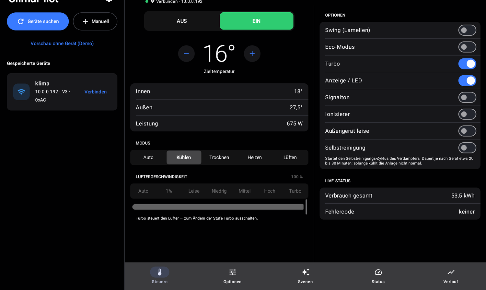
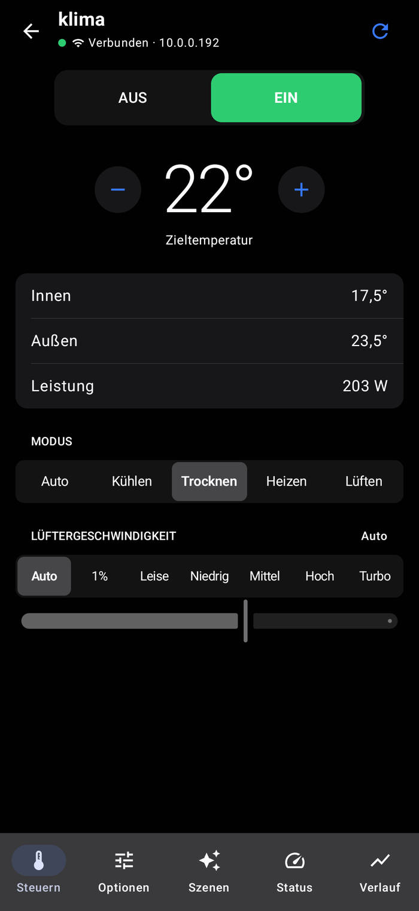
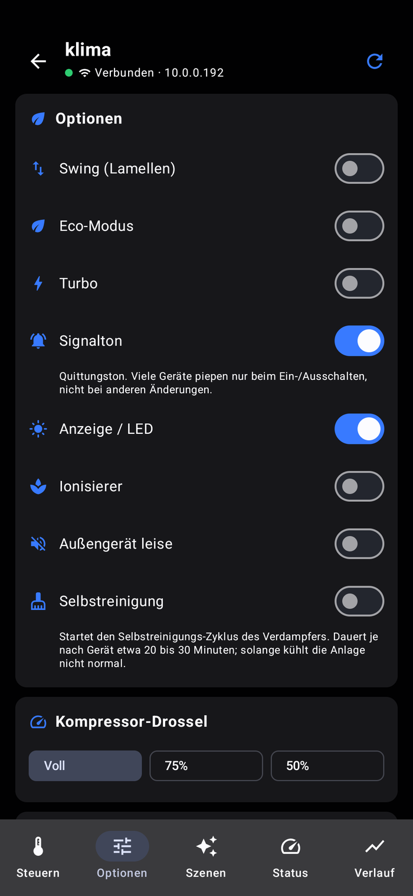
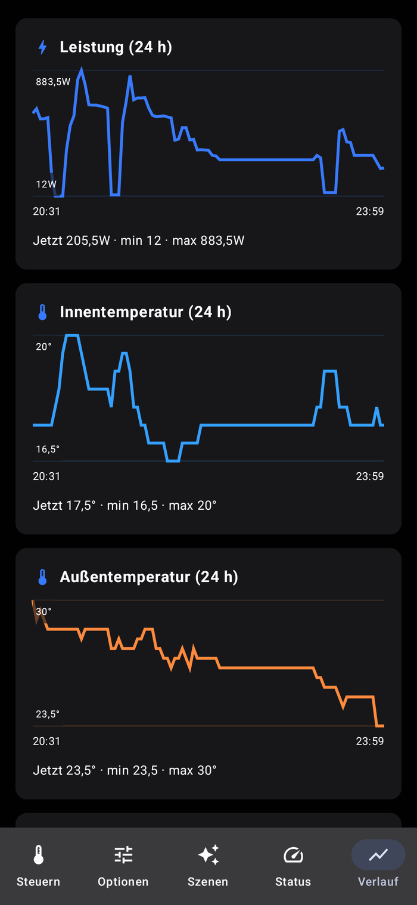
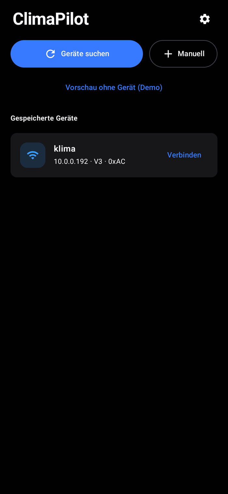
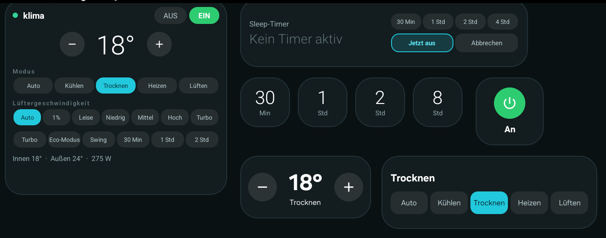

# ClimaPilot

**Control your Midea air conditioner locally over Wi-Fi. No cloud account required.**
**Steuere deine Midea-Klimaanlage lokal im WLAN. Ganz ohne Cloud-Konto.**

  

  
  &nbsp;
  
  &nbsp;
  
  &nbsp;
  

  

[English](#english) · [Deutsch](#deutsch)

---

## English

ClimaPilot is a small, ad-free Android app that talks **directly to your Midea air conditioner on the local network**. Your phone and the AC only need to be on the same Wi-Fi. Nothing is sent through a manufacturer cloud.

### Features

**Control**
- **Local control** over Wi-Fi (LAN protocol, V3 devices)
- **Works offline after the first connect.** A one-time token is fetched once (no account); afterwards no internet is needed
- Power, mode (auto, cool, dry, heat, fan), target temperature in °C or °F
- Fan speed as named presets **and a slider across the full 1 to 100 % range**
- **Turbo/boost switch.** The state is read back from the unit, so the switch also shows boost engaged from the IR remote or the official app. While turbo runs, the unit ignores fan changes, so the app greys those controls out instead of letting a tap silently snap back
- Swing, eco mode, prompt tone, and device-specific modes where supported: ionizer, outdoor-silent, self-clean (with a note on how long a cleaning run takes)
- Compressor throttle where supported

**One surface, every screen size**
- Phones show a single column, tablets show the device list beside the controls in two columns, with options and live status alongside
- The tabs Control, Options, Scenes, Status and History sit at the bottom on every device, and the app runs fullscreen
- Saved devices can be renamed or removed by long-pressing them, which is handy for telling two units apart

**Timers and automation**
- **Sleep timer** that survives a reboot, with a live countdown notification and off-now / cancel actions
- Quick scenes with a full editor and a daily schedule
- **Weekly day-planner.** Assign scenes to recurring weekday and time windows (for example maximum cooling on Mondays, 6 to 18) on a visual week calendar. Each window applies its scene at the start and can switch the AC off at the end
- Auto power-off after a maximum runtime

**Home screen**
- **All-in-one widget** with power, temperature, mode, fan speed, turbo, eco, swing and sleep presets
- **Sleep-timer widget** with a live count-down and quick presets
- **One-tap sleep tiles (1x1)** for 30 min, 1 h, 2 h, 4 h, 8 h and 12 h
- Small widgets for power, temperature and mode, plus Quick Settings tiles for power and mode
- All widgets control the AC offline, without opening the app

**Readouts**
- Live status: indoor and outdoor temperature, power draw, consumption and **estimated cost** (price per kWh)
- **Energy and filter history with charts.** Power, indoor and outdoor temperature and fan level by hour, day, week, month or a chosen day, per AC; optional background recording roughly every 15 minutes. Momentary read failures are filtered out so a single failed poll no longer paints a spike into the chart
- **Indoor temperature calibration.** Correct a sensor that reads off by up to 5 K. The corrected reading is shown everywhere with a small amber delta, **and the setpoint sent to the unit is shifted by the same whole degrees**, so the room actually reaches what you set. Saved per device
- **Diagnostics (beta).** Compressor frequency, current and voltage, refrigerant-circuit temperatures (T1 to T4, discharge pipe), indoor fan rpm, condensate pump and outdoor-unit watts. Opt-in per group under Settings, Beta features

**More**
- **Wear OS companion app** to control the AC from your watch
- **IR-remote mode.** On phones with an IR blaster, control the AC like a remote over infrared, no Wi-Fi needed
- Optional **app lock** (fingerprint or PIN) and launcher shortcuts for off, scene and demo
- Export and import the device token for an offline backup or for use in other tools
- **22 languages.** English, German, French, Italian, Spanish, Portuguese, Dutch, Swedish, Danish, Norwegian, Finnish, Polish, Czech, Slovak, Hungarian, Romanian, Greek, Croatian, Turkish, Ukrainian, Russian and Catalan. The app language can be picked separately from the phone language
- Demo mode to explore the interface without a device

> **Background reliability and trade-offs.** The sleep timer and the weekly planner use a Doze-proof alarm clock so they fire on time even in standby. As a side effect, Android shows the alarm-clock icon in the status bar while a timer or plan is active. When the alarm fires, the actual command runs as a background job with retries, so it also works if the app was closed in the meantime. For dependable timing, allow ClimaPilot to run in the background and disable battery optimisation under **Settings, Reliable timers**, especially on aggressive vendors such as Samsung and Xiaomi. The planner acts on your first connected AC, and saving or editing a plan never sends a command; windows only act at their scheduled start and end times.

### Install
1. Download the latest `climapilot-0.6.9.apk` from the [**Releases**](https://github.com/pit711/climapilot/releases) page.
2. On your phone, allow installing from unknown sources when prompted.
3. Open the app, tap **Search devices** (the phone must be on the same Wi-Fi as the AC), and connect.

If automatic discovery fails, you can add a device by hand via **Manual** (IP, port, device ID).

### Support development
ClimaPilot is free and ad-free. If it saves you a trip to the remote, a small tip keeps it going:
- **Ko-fi:** https://ko-fi.com/711it
- **PayPal:** https://paypal.me/711IT
- iOS app funding pool: https://www.paypal.com/pool/9qgPDj7E0L?sr=wccr

### Credits
Huge thanks to **[@mill1000](https://github.com/mill1000)** and the **[midea-msmart](https://github.com/mill1000/midea-msmart)** project. ClimaPilot's entire local Midea protocol, meaning the LAN handshake, encryption, command framing and the NetHome Plus cloud token exchange, is a Kotlin port of their excellent, meticulously reverse-engineered work. Without it, this app simply wouldn't exist.

### Disclaimer
ClimaPilot is an independent project and is **not affiliated with, endorsed by, or supported by Midea**. It controls compatible air conditioners over your local Wi-Fi. Make sure your unit is correctly installed and safe to operate before sending commands. Use at your own risk; the authors accept no liability for any damage or loss. Measured values such as power draw come from the device and may be inaccurate.

---

## Deutsch

ClimaPilot ist eine kleine, werbefreie Android-App, die **direkt mit deiner Midea-Klimaanlage im lokalen Netzwerk** spricht. Handy und Anlage müssen nur im selben WLAN sein. Es läuft nichts über eine Hersteller-Cloud.

### Funktionen

**Steuerung**
- **Lokale Steuerung** über WLAN (LAN-Protokoll, V3-Geräte)
- **Offline nach dem ersten Verbinden.** Einmalig wird ein Token geholt (kein Konto); danach ist kein Internet nötig
- Ein/Aus, Modus (Auto, Kühlen, Trocknen, Heizen, Lüften), Zieltemperatur in °C oder °F
- Lüfterstufe als benannte Voreinstellungen **und als Schieber über den vollen Bereich von 1 bis 100 %**
- **Turbo-Schalter.** Der Zustand wird vom Gerät zurückgelesen, der Schalter zeigt also auch Boost an, der über die Fernbedienung oder die Original-App eingeschaltet wurde. Solange Turbo läuft, nimmt die Anlage keine Lüfteränderung an, deshalb graut die App diese Bedienelemente aus, statt einen Tipper still zurückspringen zu lassen
- Swing, Eco-Modus, Signalton sowie gerätespezifische Modi, wo unterstützt: Ionisierer, Außengerät leise, Selbstreinigung (mit Hinweis, wie lange ein Reinigungslauf dauert)
- Leistungsbegrenzung des Kompressors, wo unterstützt

**Eine Oberfläche für jede Bildschirmgröße**
- Handys zeigen eine Spalte, Tablets die Geräteliste neben der Steuerung in zwei Spalten, mit Optionen und Live-Status daneben
- Die Reiter Steuern, Optionen, Szenen, Status und Verlauf sitzen auf jedem Gerät unten, die App läuft im Vollbild
- Gespeicherte Geräte lassen sich per langem Druck umbenennen oder entfernen, praktisch um zwei Anlagen zu unterscheiden

**Timer und Automatik**
- **Sleep-Timer**, der einen Neustart übersteht, mit Live-Countdown-Benachrichtigung und den Aktionen Jetzt aus und Abbrechen
- Schnell-Szenen mit vollem Editor und Tagesplan
- **Wochen-Tagesplaner.** Szenen wiederkehrenden Wochentag- und Zeit-Fenstern zuweisen (zum Beispiel maximal kühlen montags von 6 bis 18 Uhr) auf einem visuellen Wochenkalender. Jedes Fenster wendet zu Beginn seine Szene an und kann die Anlage am Ende ausschalten
- Auto-Aus nach maximaler Laufzeit

**Startbildschirm**
- **Alles-Widget** mit Ein/Aus, Temperatur, Modus, Lüfterstufe, Turbo, Eco, Swing und Sleep-Voreinstellungen
- **Sleep-Timer-Widget** mit Live-Countdown und Schnellwahl
- **Sleep-Kacheln zum Antippen (1x1)** für 30 Min, 1 Std, 2 Std, 4 Std, 8 Std und 12 Std
- Kleine Widgets für Ein/Aus, Temperatur und Modus, dazu Schnelleinstellungen-Kacheln für Ein/Aus und Modus
- Alle Widgets steuern die Anlage offline, ohne die App zu öffnen

**Anzeigen**
- Live-Status: Innen- und Außentemperatur, Leistung, Verbrauch und **geschätzte Kosten** (Preis pro kWh)
- **Energie- und Filter-Verlauf mit Charts.** Leistung, Innen- und Außentemperatur und Lüfterstufe nach Stunde, Tag, Woche, Monat oder gewähltem Tag, pro Anlage; optionale Hintergrund-Aufzeichnung etwa alle 15 Minuten. Kurze Lese-Aussetzer werden herausgefiltert, ein einzelner fehlgeschlagener Abruf malt also keine Spitze mehr ins Diagramm
- **Innentemperatur-Kalibrierung.** Einen Fühler korrigieren, der bis zu 5 K danebenliegt. Der korrigierte Wert erscheint überall mit einem kleinen bernsteinfarbenen Delta, **und der an das Gerät gesendete Sollwert wird um dieselben ganzen Grad verschoben**, damit der Raum wirklich erreicht, was eingestellt ist. Gilt pro Gerät
- **Diagnose (Beta).** Kompressor-Frequenz, -Strom und -Spannung, Kältekreis-Temperaturen (T1 bis T4, Druckrohr), Innenlüfterdrehzahl, Kondensatpumpe und Watt des Außengeräts. Je Gruppe unter Einstellungen, Beta-Funktionen aktivierbar

**Weiteres**
- **Wear-OS-App**, um die Anlage von der Uhr zu steuern
- **IR-Fernbedienungs-Modus.** Auf Handys mit IR-Blaster die Anlage wie mit einer Fernbedienung über Infrarot steuern, ohne WLAN
- Optionale **App-Sperre** (Fingerabdruck oder PIN) und Launcher-Shortcuts für Aus, Szene und Demo
- Geräte-Token exportieren und importieren, als Offline-Sicherung oder zur Nutzung in anderen Tools
- **22 Sprachen.** Englisch, Deutsch, Französisch, Italienisch, Spanisch, Portugiesisch, Niederländisch, Schwedisch, Dänisch, Norwegisch, Finnisch, Polnisch, Tschechisch, Slowakisch, Ungarisch, Rumänisch, Griechisch, Kroatisch, Türkisch, Ukrainisch, Russisch und Katalanisch. Die App-Sprache lässt sich getrennt von der Telefonsprache wählen
- Demo-Modus, um die Oberfläche ohne Gerät auszuprobieren

> **Hintergrund-Zuverlässigkeit und Kompromisse.** Sleep-Timer und Wochenplaner nutzen einen Doze-festen Wecker-Alarm, damit sie auch im Standby pünktlich auslösen. Als Nebeneffekt zeigt Android das Wecker-Symbol in der Statusleiste, solange ein Timer oder Plan aktiv ist. Wenn der Alarm auslöst, läuft der eigentliche Befehl als Hintergrund-Auftrag mit Wiederholungen, er funktioniert also auch, wenn die App zwischenzeitlich geschlossen wurde. Für verlässliches Timing die App im Hintergrund erlauben und die Akku-Optimierung deaktivieren, unter **Einstellungen, Zuverlässige Timer**, besonders bei aggressiven Herstellern wie Samsung und Xiaomi. Der Planer wirkt auf die erste verbundene Anlage, und das Speichern oder Bearbeiten eines Plans sendet nie einen Befehl; Fenster wirken nur zu ihren geplanten Start- und Endzeiten.

### Installation
1. Lade die aktuelle `climapilot-0.6.9.apk` von der [**Releases**](https://github.com/pit711/climapilot/releases)-Seite.
2. Erlaube auf dem Handy bei der Nachfrage die Installation aus unbekannten Quellen.
3. Öffne die App, tippe auf **Geräte suchen** (Handy im selben WLAN wie die Anlage) und verbinde dich.

Falls die automatische Suche scheitert, kannst du ein Gerät per **Manuell** von Hand hinzufügen (IP, Port, Geräte-ID).

### Entwicklung unterstützen
ClimaPilot ist kostenlos und werbefrei. Wenn es dir den Weg zur Fernbedienung erspart, hält ein kleines Trinkgeld es am Leben:
- **Ko-fi:** https://ko-fi.com/711it
- **PayPal:** https://paypal.me/711IT
- Sammelpool für iOS-Hardware: https://www.paypal.com/pool/9qgPDj7E0L?sr=wccr

### Danksagung
Riesigen Dank an **[@mill1000](https://github.com/mill1000)** und das Projekt **[midea-msmart](https://github.com/mill1000/midea-msmart)**. Das komplette lokale Midea-Protokoll von ClimaPilot, also LAN-Handshake, Verschlüsselung, Befehls-Framing und der NetHome-Plus-Cloud-Token-Austausch, ist eine Kotlin-Portierung ihrer hervorragenden, akribisch reverse-engineerten Arbeit. Ohne sie würde es diese App nicht geben.

### Haftungsausschluss
ClimaPilot ist ein unabhängiges Projekt und steht **in keiner Verbindung zu Midea, wird von Midea weder unterstützt noch freigegeben**. Die App steuert kompatible Klimaanlagen über dein lokales WLAN. Stelle sicher, dass dein Gerät korrekt installiert und betriebssicher ist, bevor du Befehle sendest. Die Nutzung erfolgt auf eigene Gefahr; die Autoren übernehmen keine Haftung für Schäden oder Verluste. Messwerte wie die Leistung stammen vom Gerät und können ungenau sein.
